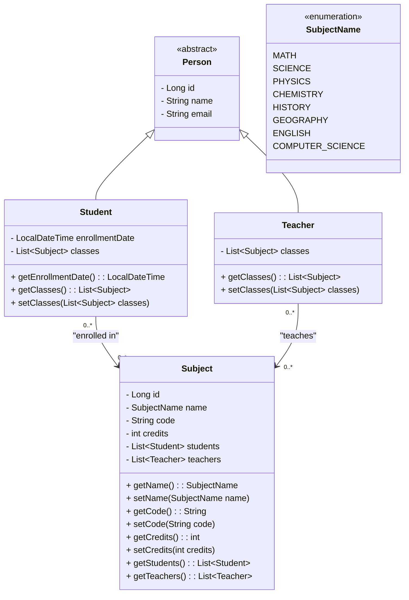
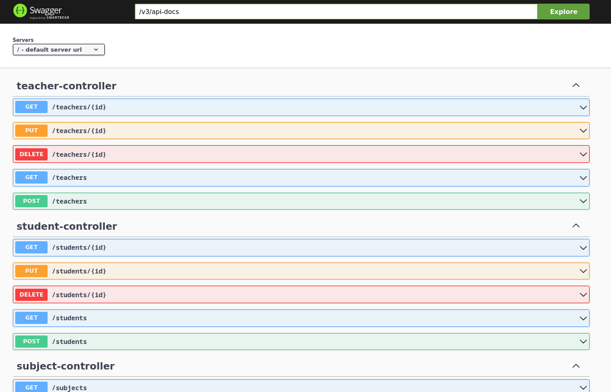
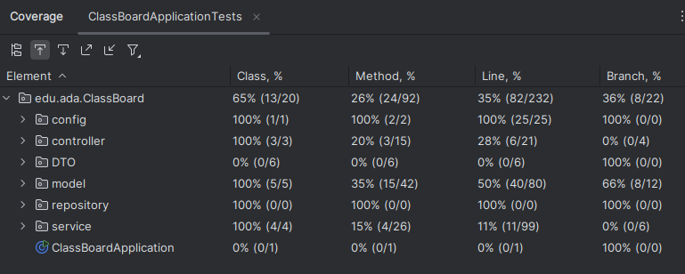

# Projeto ClassBoard
O ClassBoard é uma aplicação para gestão de informações acadêmicas. Permite cadastrar e gerenciar estudantes, professores e matérias, além de registrar suas associações. Ele foi desenvolvido para demonstrar conceitos de Programação Orientada a Objetos, persistência de dados e práticas recomendadas no desenvolvimento com o Spring Framework.
<p align="center">
     <a alt="Java" href="https://java.com" target="_blank">
        
    </a>
    <a alt="Spring Boot" href="https://spring.io/projects/spring-boot" target="_blank">
        
    </a>
    <a alt="Hibernate" href="https://hibernate.org/" target="_blank">
        
    </a>
     <a alt="Maven" href="https://maven.apache.org/index.html" target="_blank">
        
    </a>
    <a alt="H2 database" href="https://www.h2database.com/html/main.html"  target="_blank">
        
    </a>
    <a alt="Swagger" href="https://swagger.io/"  
target="_blank">
        
    </a>
     <a alt="IntelliJ IDEA" href="https://www.jetbrains.com/idea/" target="_blank">
        
    </a>
</p>

## Sumário

- [Funcionalidades](#funcionalidades)
- [Diagrama de Classes](#diagrama-de-classes)
- [Endpoints Disponíveis](#endpoints-disponíveis)
- [Acesso ao Projeto](#acesso-ao-projeto)
- [Testes](#testes)
- [Autora](#autora)

---
## Funcionalidades

### Gerenciamento de Alunos, Professores e Aulas/Matérias:
- Cadastro, edição e exclusão de entidades bem como 
  suas distribuições.
---

## Diagrama de Classes

---
## Endpoints Disponíveis

1. **Estudantes (/students)**
   * GET /students - Retorna todos os estudantes. 
   * GET /students/{id} - Retorna um estudante por ID.
   * POST /students - Cria um novo estudante.
   * PUT /students/{id} - Atualiza um estudante existente.
   * DELETE /students/{id} - Deleta um estudante.

   <br>
2. **Professores (/teachers)**
   * GET /teachers - Retorna todos os professores.
   * GET /teachers/{id} - Retorna um professor por ID.
   * POST /teachers - Cria um novo professor.
   * PUT /teachers/{id} - Atualiza um professor existente.
   * DELETE /teachers/{id} - Deleta um professor.

   <br>
3. **Classes (/subjects)**
  * GET /subjects - Retorna todos as aulas/matérias.
  * GET /subjects/{id} - Retorna um aula/matéria por ID.
---
## Acesso ao projeto

### Pré-requisitos
* Java 21+
* Maven

### Como executar

1. Clone o repositório.
```bash    
    ` git clone git@github.com:Elisabete-MO/java-classboard.git` 
```
2. Navegue até o diretório do projeto:
```bash
cd java-classboard
```
3. Configure o banco de dados (opcional): 
<br>Por padrão, a aplicação usa o H2 Database em memória.
<br>
<br>
4. Execute o comando:
``` bash
mvn spring-boot:run
```
5. Acesse o console [H2](http://localhost:8080/h2-console) (opcional):
<br> Credenciais padrão: usuário teste, senha teste123.
<br>
<br>
6. Acesse a documentação [Swagger](http://localhost:8080/swagger-ui/index.
   html#/), para visualização dos endpoints e poder testá-los diretamente pelo navegador. Isso facilita a exploração da API 
   sem a necessidade de uma ferramenta externa. para explorar os endpoints.



---
## Testes


### Executando os testes pela IDE

1. Certifique-se de que o projeto está aberto em uma IDE compatível.
2. Navegue até a pasta src/test/java.
3. Clique com o botão direito sobre o pacote de testes (ClassBoard).
4. Selecione a opção "Run '_All Tests_'"

### Executando os testes pelo Maven

1. Navegue até o diretório raiz do projeto:
```bash
cd java-classboard
```
2. Execute o seguinte comando:
```bash
mvn test
```

3. O Maven executará todos os testes definidos no projeto e exibirá o resultado no terminal.


---


## Autora
<table>
  <tr>
    <td align="center">
      <a href="https://github.com/Elisabete-MO">
        <br />
        <sub><b>Elisabete Oliveira</b></sub>
      </a>
    </td>
  </tr>
</table>
